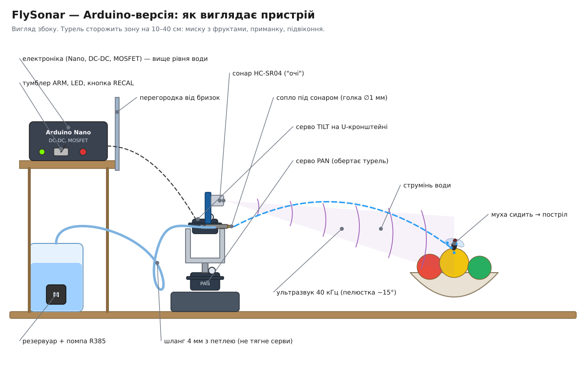

# 🪰 fly-defense

Два DIY-проєкти на Arduino для боротьби з мухами:

| Проєкт | Принцип | Сенсор | Виконавчий механізм | Реакція |
|---|---|---|---|---|
| [**FlyClap**](docs/flyclap.md) | «Хлопавка»: муха пролітає між пластинами → вони схлопуються | ІЧ-завіса (4 промені) + LM339 | Соленоїд-засувка + пружини, серво взводить | ~25 мс |
| [**FlySonar — Arduino**](docs/flysonar.md) | Турель: ехолокатор сканує зону, водомет стріляє по цілі | HC-SR04 на pan-tilt | Помпа або клапан + сопло, 2 серви | ~3 с скан + ~1–2 с уточнення |
| [**FlySonar — ESP32**](docs/flysonar-esp32.md) | Та сама турель на одній ESP32-CAM: камера над підсвіченим фоном, бачить і мошку | ESP32-CAM + LED-панель | Клапан + розпилювач, 2 серви | ~70–90 мс |

## Структура

```
fly-defense/
├── firmware/
│   ├── flyclap/flyclap.ino     # ІЧ-завіса + хлопавка
│   ├── flysonar/flysonar.ino   # FlySonar, Arduino-версія (сонар або цілі від ESP32)
│   └── flysonar_esp32/         # FlySonar, ESP32-версія (одна плата, камера)
│       ├── flysonar_esp32.ino
│       ├── vision.h            # зір без залежностей (тестується на ПК)
│       └── turret.h            # логіка пострілу (тестується на ПК)
├── docs/
│   ├── flyclap.md              # механіка, BOM, схема, налаштування
│   ├── flysonar.md             # Arduino-версія
│   ├── flysonar-esp32.md       # ESP32-версія: фон, підключення, калібрування
│   └── shopping-list.md        # зведений список покупок для обох проєктів
├── schematics/                 # схеми підключення та ілюстрації (SVG + PNG)
├── tools/                      # хост-тести, генератор схем (diagrams.py)
├── platformio.ini
└── LICENSE
```

Що купити — див. [docs/shopping-list.md](docs/shopping-list.md).

## Як виглядають пристрої

| FlyClap | FlySonar — Arduino | FlySonar — ESP32 |
|---|---|---|
|  |  |  |
| [схема підключення](schematics/flyclap-wiring.svg) · [варіант TSSP4038](schematics/flyclap-tssp.svg) | [схема підключення](schematics/flysonar-arduino-wiring.svg) | [схема підключення](schematics/flysonar-esp32-wiring.svg) |

Усі картинки — у папці [`schematics/`](schematics/) (SVG і PNG для друку/телефона). Їх генерує `tools/diagrams.py`: правите скрипт → `python3 tools/diagrams.py --png`.

## Збірка

### Arduino IDE
Відкрити `firmware/flyclap/flyclap.ino` або `firmware/flysonar/flysonar.ino`, обрати плату **Arduino Uno** (Tools → Board → Arduino AVR Boards → Arduino Uno) і прошити. Потрібні лише стандартні бібліотеки `Servo` та `EEPROM`.

### PlatformIO
```bash
pio run -e flyclap -t upload
pio run -e flysonar -t upload
pio device monitor -b 115200
```

> Клони Uno на CH340 потребують драйвера CH340 (Windows/macOS), якщо плату не видно як COM/tty-порт.
>
> Прошивки використовують лише ресурси ATmega328P і працюють без змін і на Nano. Для нього є окремі середовища: `pio run -e flyclap_nano -t upload`, `pio run -e flysonar_nano -t upload`.

FlySonar, ESP32-версія: `pio run -e flysonar_esp32 -t upload` (ESP32-CAM) або `flysonar_esp32_s3` (ESP32-S3 CAM) — див. [docs/flysonar-esp32.md](docs/flysonar-esp32.md).

Інші варіанти: `flyclap_tssp` (завіса TSSP4038), `flysonar_camera` (+ `_nano`) разом з `flysonar_esp32_eyes` (ESP32 як «очі» для Arduino).

### Тести
```bash
tools/run_tests.sh   # потрібен лише g++
```
ESP32-версія: зір на синтетичних кадрах і логіка турелі. Arduino-версія: режим цілей від камери та симуляція сонара (віртуальна кімната + модель пелюстки HC-SR04).

## Безпека

- **FlyClap**: механізм у корпусі з сіткою ~8 мм, пальці не пролазять. Соленоїд живиться лише короткими імпульсами.
- **FlySonar**: фільтр великих об'єктів не стріляє по руках і тваринах, а режим SAFE (тумблер ARM вимкнено) тільки логує цілі. Електроніку тримайте вище за рівень води й за перегородкою.
- Жодних лазерів і високої напруги: свідоме архітектурне рішення, пояснене в [docs/flyclap.md](docs/flyclap.md).

## Ліцензія

MIT, див. [LICENSE](LICENSE).
