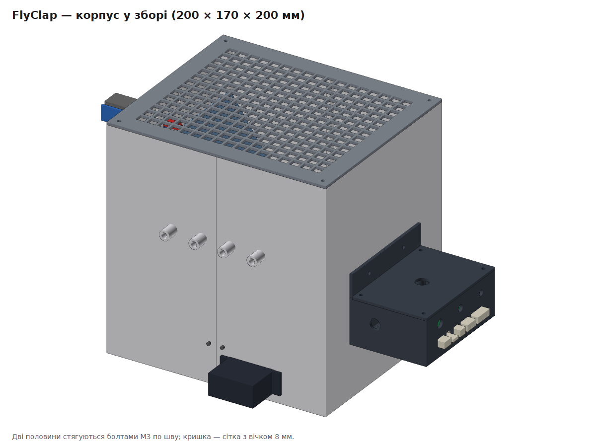
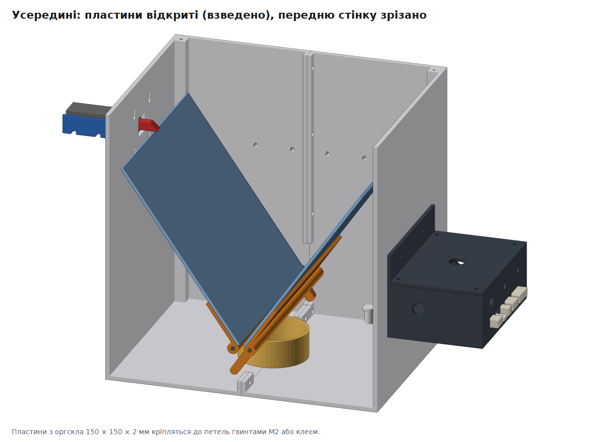
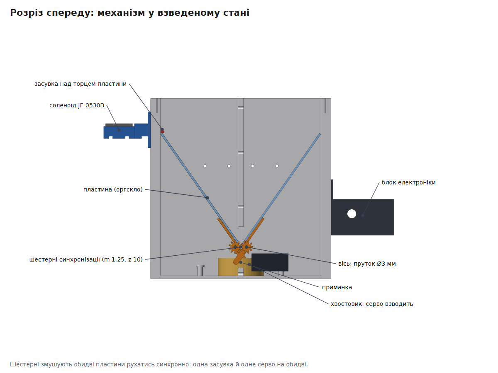
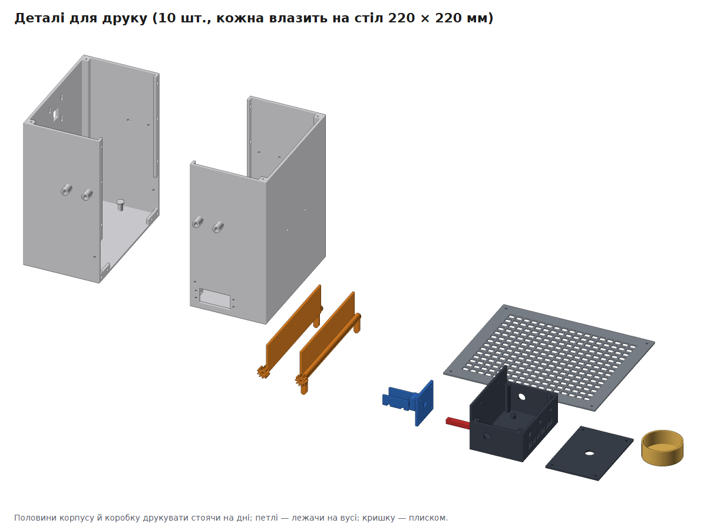
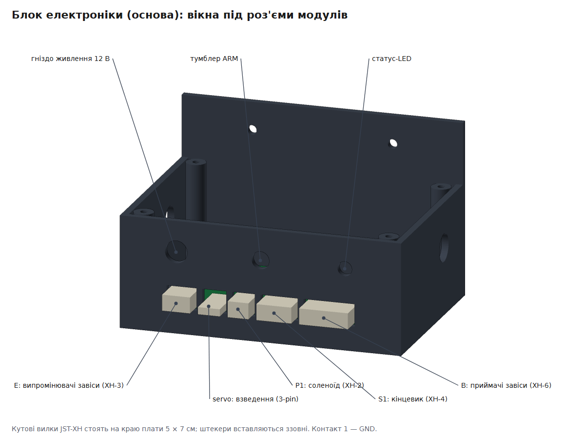

# FlyClap — корпус і механіка для 3D-друку

Параметрична модель корпусу FlyClap під звичайний FDM-принтер зі столом **220 × 220 мм** (висота друку до 200 мм). Габарити корпусу **200 × 170 × 200 мм**. Він складається з двох половин, стягнутих болтами М3.

| Усередині (передню стінку зрізано) | Розріз спереду: механізм |
|---|---|
|  |  |

## Файли

| Що | Для чого |
|---|---|
| [`step/`](step/) | кожна деталь окремо у STEP. **Відкривається у FreeCAD** як тверде тіло (File → Open) |
| [`flyclap_assembly.step`](flyclap_assembly.step) | усе складання з кольорами й назвами деталей (пластини відкриті) |
| [`stl/`](stl/) | для слайсера (Cura, PrusaSlicer, OrcaSlicer) |
| [`flyclap_case.py`](flyclap_case.py) | параметрична модель (CadQuery), з неї згенеровано все вище |
| [`preview/`](preview/) | картинки |

### Як відкрити у FreeCAD
1. **File → Open** → `flyclap_assembly.step`. У дереві з'являться всі деталі з назвами й кольорами.
2. **File → Save As** → `FlyClap.FCStd`. Тепер це звичайний документ FreeCAD: деталі можна рухати, міряти, доробляти в Part Design (кнопка *Create body* поверх імпортованої деталі).
3. Окрему деталь для правок відкривайте з папки `step/`.

> Модель зроблена в CadQuery, на тому ж геометричному ядрі OpenCascade, що й FreeCAD. STEP передає точну геометрію, а не сітку трикутників. Параметричну історію (дерево операцій FreeCAD) через STEP не передати, тому розміри зручніше міняти у скрипті (див. нижче).

## Деталі для друку

| Деталь | К-сть | Орієнтація на столі | Примітка |
|---|---|---|---|
| `shell_left`, `shell_right` | по 1 | стоячи на дні | 100 × 197 × 200 мм, підтримки не потрібні (вікно серви — міст 41 мм) |
| `lid_mesh` | 1 | плиском | сітка з вічком 8 мм |
| `hinge_left`, `hinge_right` | по 1 | лежачи на вусі | ліва й права **різні**: шестерні зсунуті на півзуба |
| `latch_mount` | 1 | плиском на монтажній пластині | люлька під соленоїд + напрямна засувки |
| `latch_bolt` | 1 | лежачи | засувка 6 × 6 зі скосом |
| `electronics_box`, `electronics_lid` | по 1 | коробка стоячи, кришка плиском | основа: плата 5 × 7 см, вікна під роз'єми JST-XH |
| `bait_cup` | 1 | стоячи | чашка для приманки ∅50 |

**Налаштування:** PETG (або PLA для приміщення), шар 0,2 мм, 3 периметри, заповнення 20 %. Для петель 4 периметри й 40 %: на них шестерні.

## Кріплення та інше (не друкується)

| Деталь | К-сть | Для чого |
|---|---|---|
| Оргскло 150 × 150 × 2 мм | 2 | пластини |
| Сталевий пруток ∅3 мм, довжина 176 мм (або шпилька М3 180 мм + 4 гайки) | 2 | осі петель |
| Гвинт М3 × 10 + гайка | 16 | шов половинок (10), кріплення засувки (4), блок електроніки (2) |
| Гвинт М3 × 8 (саморіз у пластик) | 8 | кришка-сітка (4), кришка блока (4) |
| Гвинт М2 × 8 + гайка | 6 | пластини до петель (по 3) |
| Гвинти з комплекту серви або М3 × 12 + гайки | 4 | MG996R |
| Канцелярські гумки або пружини розтягу | 2 | стягують пластини |
| Стяжки 3 мм | 2 | соленоїд у люльці |

## Складання

1. **Отвори.** Прочистіть отвори свердлом: 3,2 мм під М3, 3,3 мм у петлях (мають вільно обертатися на прутку).
2. **ІЧ-завіса.** Світлодіоди вставте в передні тунелі, фототранзистори в задні, **ззовні**, щоб деталь сиділа на зовнішньому кінці тунелю. Тоді тунель звужує промінь і захищає від стороннього світла. Зафіксуйте краплею клею.
3. **Пластини.** Просвердліть у пластинах по 3 отвори ∅2,2 навпроти отворів у вусі петлі й прикрутіть М2. Пластина лягає на вусо **з внутрішнього боку**, так що закриті пластини сходяться точно по центру.
4. **Петлі в половинки.** Кожна петля заходить у свою половину; пруток проходить крізь передню стінку, петлю й задню стінку.
5. **З'єднання половинок.** Обидві пластини поставте вертикально (закрито), зведіть половинки, щоб шестерні зачепились, і стягніть шов болтами. Покачайте пластини: вони мають розкриватися синхронно й без заїдань.
6. **Гумки.** Від отвору в задньому хвостовику петлі до стійки на дні своєї половини. Гумка має тягнути пластини до закриття.
7. **Серво.** MG996R вставте у вікно передньої стінки ззовні (вал усередину), закріпіть 4 гвинтами. Качалка має штовхати передній хвостовик правої петлі. Кути підберіть у прошивці: `SERVO_COCK_DEG` / `SERVO_REST_DEG`.
8. **Засувка.** Кріплення притуліть до лівої стінки ззовні, засувку вставте в напрямну скосом **вгору**, з'єднайте з якорем соленоїда (дріт або шпилька через отвір ∅2,2), соленоїд закріпіть стяжками. Пази в стінці дають ±3 мм по висоті. Виставте так, щоб у взведеному стані засувка ледь нависала над верхнім торцем лівої пластини.
9. **Кінцевик «взведено».** Мікроперемикач з важелем приклейте або прикрутіть біля засувки, щоб торець пластини натискав важіль у взведеному стані. Окремого кріплення в моделі немає: його положення залежить від конкретного перемикача.
10. **Блок електроніки.** Вушком до правої стінки, 2 × М3. Кришка сітки — 4 саморізи в кутові стійки. Кутові вилки JST-XH припаюйте на краю плати навпроти вікон (див. нижче).

## Роз'єми модулів (блок електроніки)

Блок електроніки — це **основа** модульної системи ([docs/modules.md](../../docs/modules.md)): до неї роз'ємами підключаються завіса, засувка, серво й кінцевик. Плата 5 × 7 см стоїть на чотирьох стійках, зсунута до стінки з вікнами: між краєм плати й стінкою 0,6 мм. **Кутові вилки JST-XH (S2B/S3B/S4B/S6B-XH-A) і кутову гребінку серви припаюйте на самому краю плати, навпроти свого вікна**; тоді штекер модуля вставляється ззовні крізь стінку. Над вікнами — отвори під гніздо живлення ∅8, тумблер ARM ∅6,3 і статус-LED ∅5,2; у торцях — отвори ∅10 під силові дроти.

| Вікно (від переду до заду) | Роз'єм | Модуль |
|---|---|---|
| E | XH-3 | випромінювачі завіси (спереду корпусу) |
| servo | 3-pin 2,54 | серво взведення |
| P1 | XH-2 | соленоїд засувки |
| S1 | XH-4 | кінцевик «взведено» |
| B | XH-6 | приймачі завіси (ззаду корпусу) |

Набір і порядок вікон задає список `BASE_PORTS` на початку скрипта; саму коробку будує `base_box()` у [`cad/cadlib.py`](../cadlib.py).

## Що перевіряє скрипт

`python3 cad/flyclap/flyclap_case.py` (потрібно `pip install cadquery`) не лише генерує файли, а й перевіряє:
- кожна деталь влазить на стіл 220 × 220 × 250 мм і є одним цілим тілом (не розпадеться в слайсері);
- **деталі не перетинаються** ні у відкритому, ні в закритому стані, ні **на всьому ході пластин** (0…35° з кроком 5°). Це стосується шестерень, хвостовиків, пластин, стінок, чашки, серви, засувки, кришки й блока електроніки;
- засувка у взведеному стані справді нависає над торцем пластини;
- плата стає на стійки блока електроніки, а **кожен штекер проходить у своє вікно** (муляжі плати й штекерів не перетинаються з коробкою й кришкою).

Прапорці: `--no-export` (лише перевірки), `--preview` (перемалювати картинки; потрібні numpy і Chromium, шлях можна задати змінною `CHROME`).

## Змінити розміри

Усі розміри винесені на початок `flyclap_case.py`: розмір і кут розкриття пластин, стінки, положення ІЧ-променів, розміри серви й соленоїда, зазор FDM `CLR`. Змініть число, запустіть скрипт, і перевірки покажуть, чи нічого не зачіпається.

## Обмеження (чесно)

- **Вікна під роз'єми** розраховано за розмірами колодок JST-XH з даташита (ширина 2,5 × (n − 1) + 4,9 мм) із зазором 0,8 мм. Розташування вилок на платі залежить від вашого монтажу: приміряйте плату в коробці до пайки.

- **Розміри покупних деталей** (MG996R, JF-0530B, соленоїд і його якір) взято з типових креслень. **Звірте свої штангенциркулем** і за потреби виправте параметри `SERVO_*` / `SOL_*`: клони відрізняються на 0,5–2 мм.
- **Зв'язок засувки з якорем соленоїда** залежить від конкретного соленоїда: у моделі є лише отвір під шпильку.
- **Качалка серви** не змодельована: її довжину й кут підберіть по місцю.
- **Нічого не надруковано й не перевірено на залізі**: перевірки геометричні. Шестерні m 1,25 друкуються нормально соплом 0,4 мм, але перший раз варто надрукувати петлі окремо й перевірити зачеплення.
- **Висота 200 мм:** на принтерах з меншою висотою друку (Prusa MK3 — 210 мм, деякі — 180 мм) зменшіть `H` і `PLATE`.
