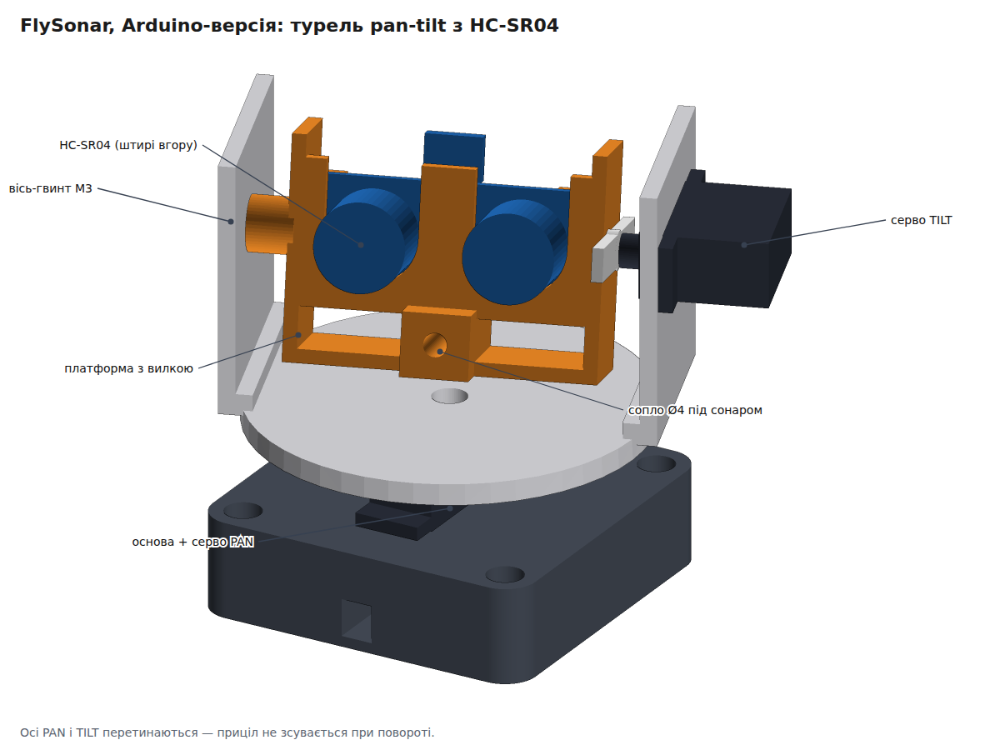
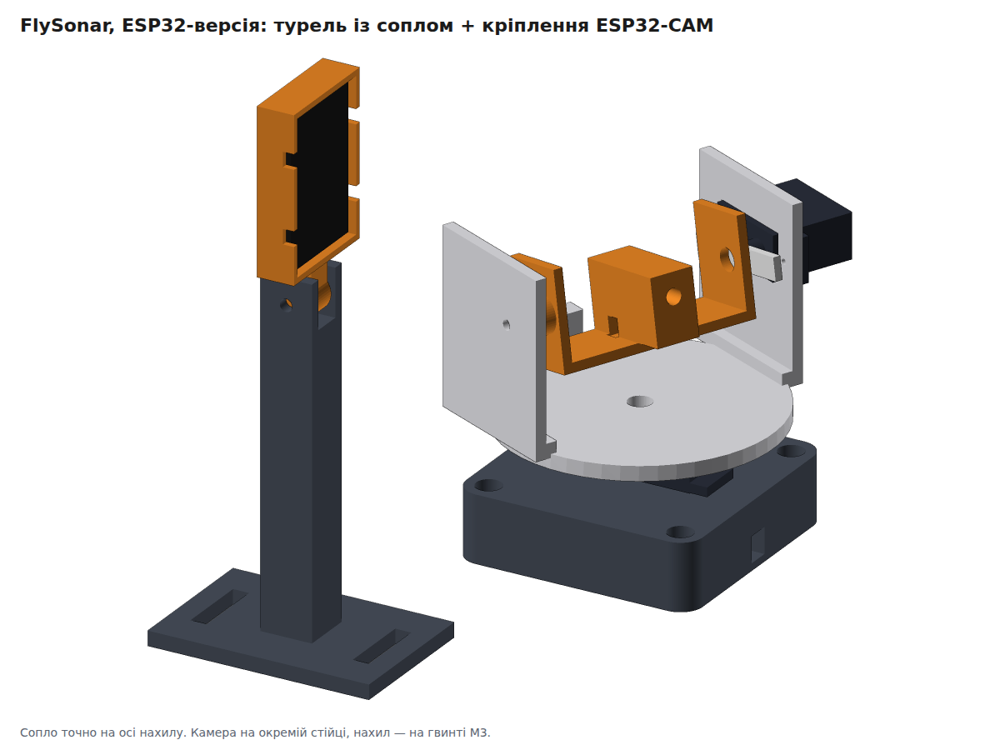
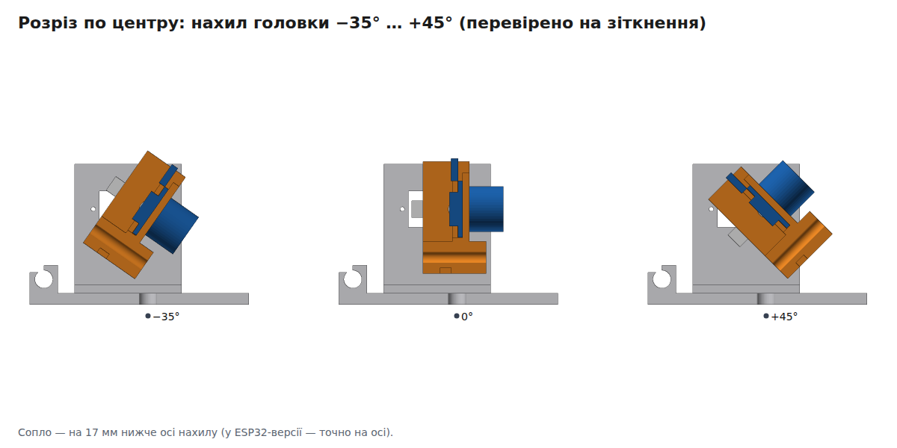
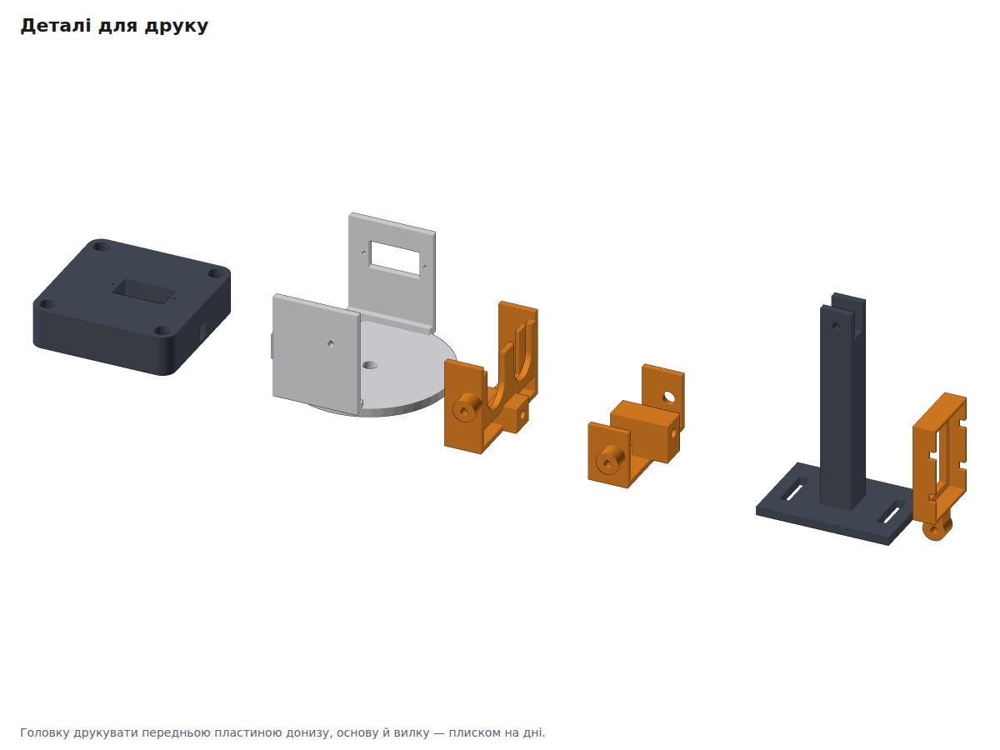

# FlySonar — турель pan-tilt для 3D-друку

Одна поворотна основа під **дві версії** FlySonar:

| | Головка | Що ще друкувати |
|---|---|---|
| **Arduino-версія** ([docs/flysonar.md](../../docs/flysonar.md)) | `head_sonar`: HC-SR04 + сопло Ø4 під ним | — |
| **ESP32-версія** ([docs/flysonar-esp32.md](../../docs/flysonar-esp32.md)) | `head_nozzle`: лише сопло, точно на осі нахилу | `camera_post` + `camera_cradle` (кріплення ESP32-CAM) |

Під мікросерво **MG90S / SG90 / ES08MD**. Осі PAN і TILT перетинаються в одній точці, тож приціл не зсувається при повороті. Габарит турелі разом із серво TILT — близько 95 × 80 мм, висота до осі нахилу 65 мм.

| ESP32-версія | Нахил (розріз по центру) |
|---|---|
|  |  |

## Файли

| Що | Для чого |
|---|---|
| [`step/`](step/) | кожна деталь у STEP. **Відкривається у FreeCAD** (File → Open) |
| [`turret_arduino_assembly.step`](turret_arduino_assembly.step), [`turret_esp32_assembly.step`](turret_esp32_assembly.step) | складання з кольорами й назвами (разом із муляжами серв і HC-SR04) |
| [`stl/`](stl/) | для слайсера |
| [`flysonar_turret.py`](flysonar_turret.py) | параметрична модель (CadQuery) з перевірками |

Щоб отримати документ FreeCAD: відкрийте складання й зробіть **File → Save As → `.FCStd`**.

## Деталі для друку

| Деталь | Орієнтація на столі | Примітка |
|---|---|---|
| `base` | плиском на дні | кишеня під серво PAN, проріз для кабелю, 4 отвори для кріплення до дошки |
| `yoke` | платформою донизу | платформа + вилка; права стійка з вікном під серво TILT, ззаду затискач шланга |
| `head_sonar` | передньою пластиною донизу | U-пази під випромінювачі HC-SR04, блок сопла |
| `head_nozzle` | плиском на дні | для ESP32-версії |
| `camera_post` | плиском на основі | стійка ESP32-CAM, висота осі 90 мм |
| `camera_cradle` | лицьовою рамкою донизу | рамка під плату 27 × 40,5 з великим вікном під лінзу |

PETG або PLA, шар 0,2 мм, 3 периметри, 20–30 %. Підтримки не потрібні.

## Кріплення та інше

| Що | К-сть | Для чого |
|---|---|---|
| Мікросерво MG90S (або цифрові ES08MD II) | 2 | PAN і TILT |
| Саморізи 2 мм з комплекту серв | 8 | вушка серв (по 4) |
| Саморізи з комплекту серв | 2 + 4 | центральні гвинти качалок + качалки до платформи й головки |
| Гвинт М3 × 12 | 1 | вісь нахилу з лівого боку: вкручується в стійку (отвір 2,8), головка обертається на ньому |
| Гвинти М3 / шурупи 3,5 мм | 4 | основа до дошки |
| Гвинт М3 × 16 + гайка | 1 | вісь нахилу камери (ESP32-версія) |
| Гвинти М4 | 2 | стійка камери до дошки |
| Латунна трубка / голка Ø4 | 1 | сопло |
| Стяжки 3 мм | 3 | сопло, плата ESP32-CAM |

## Складання

1. **Спершу виставте обидві серви на 90°** (прошивкою або тестером), і лише потім надягайте качалки. Тоді 90° означає «прямо вперед» і «горизонтально», як очікує прошивка.
2. **Серво PAN** вставте в основу (кабель у проріз, вушка лягають на верх), прикрутіть саморізами.
3. **Качалка PAN → платформа.** Покладіть качалку на низ платформи по центру, позначте отвори, просвердліть ∅1,5 і прикрутіть. Надягніть платформу на вал так, щоб вилка дивилась уперед (+X), і закрутіть центральний гвинт через отвір у платформі.
4. **Серво TILT** вставте у вікно правої стійки ззовні (вал усередину, корпус назад) і прикрутіть вушка.
5. **Головка.**
   - `head_sonar`: HC-SR04 **штирями вгору** опустіть згори в паз, щоб випромінювачі лягли в U-пази передньої пластини. Сопло вставте в отвір під сонаром і притягніть стяжкою.
   - `head_nozzle`: сопло в центральний отвір, стяжка.
6. **Качалка TILT → права щока головки.** Центр качалки над отвором ∅6, отвори просвердлити по місцю. Надягніть головку качалкою на вал серви (горизонтально), закрутіть центральний гвинт через отвір ∅6. Зліва вкрутіть М3 × 12 крізь стійку у втулку головки: головка обертається на гвинті.
7. **Шланг** з петлею-запасом проведіть через затискач ззаду платформи.
8. **ESP32-CAM:** плату вкладіть у рамку ззаду камерою до вікна, притягніть двома стяжками. Рамку вставте язичком у вилку стійки на М3 × 16: гайка дає фіксацію нахилу.

## Що перевіряє скрипт

`python3 cad/flysonar/flysonar_turret.py` (потрібно `pip install cadquery`):
- кожна деталь влазить на стіл 220 × 220 × 250 мм і є одним цілим тілом;
- **жодних зіткнень** на всьому діапазоні руху: нахил −35…+45°, поворот −90…+90° (прошивка використовує ±60°), для обох головок. Перевіряються вилка, серви, качалки, головка, HC-SR04 і основа;
- **HC-SR04 справді вставляється** згори в головку (плата ковзає 40 мм і ніде не чіпляє). Ця перевірка з'явилася після того, як перша версія з круглими отворами виявилася нескладальною;
- рамка камери нахиляється на ±25° і не зачіпає стійку.

Прапорці: `--no-export` (лише перевірки), `--preview` (картинки; numpy і Chromium, шлях можна задати в `CHROME`).

## Змінити розміри

Параметри на початку скрипта: розміри серви (`SV_*`), HC-SR04 (`SR_*`), діаметр сопла `NOZ_D` (6,2 для силіконової трубки 4 × 6), висота осі нахилу, висота стійки камери, зазор `CLR`. Після змін запустіть скрипт: перевірки покажуть, чи нічого не зачіпається.

## Обмеження (чесно)

- **Розміри серв і HC-SR04** взято з типових креслень, а клони відрізняються до 1 мм. **Звірте штангенциркулем** і за потреби виправте `SV_*` / `SR_*`. Найважливіші — відстань від торця корпусу до вала `SV_SHAFT_OFF` і висота вушок `SV_TAB_Z`.
- **Отвори під гвинти качалок** не змодельовані, бо форма качалок різна. Їх свердлять по місцю (крок 3 і 6).
- **Не надруковано й не перевірено на залізі:** перевірки геометричні. Мікросерво тримає головку з HC-SR04 без проблем, але шланг має бути м'який, з петлею, щоб не тягнув турель.
- **Паралакс сопла.** У Arduino-версії сопло на 17 мм нижче сонара, і прошивка це враховує (`TILT_NOZZLE_OFFSET10`). Після складання уточніть поправки пробними пострілами, як описано в [docs/flysonar.md](../../docs/flysonar.md).
