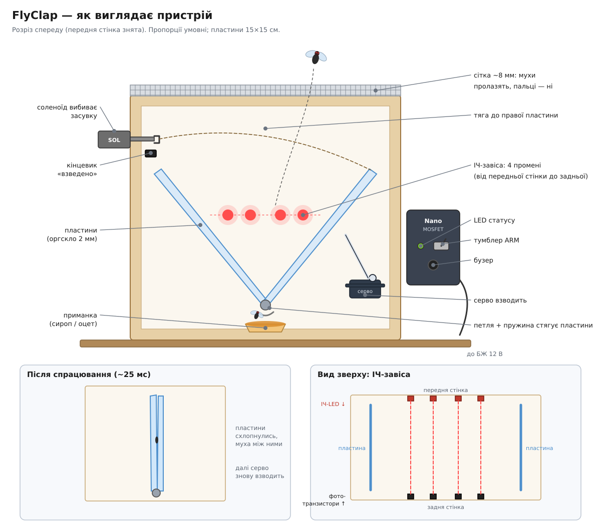
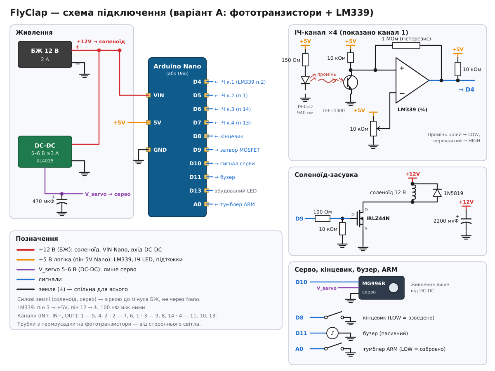
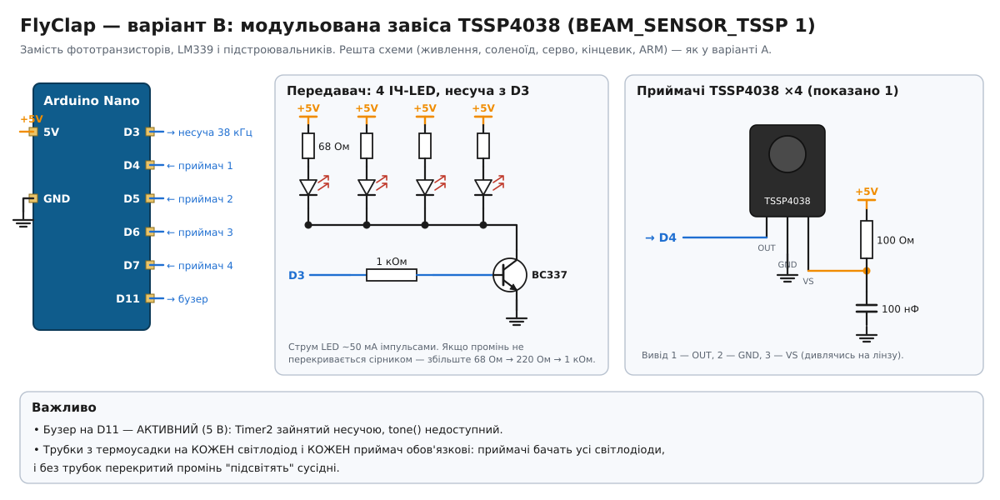

# FlyClap — збивач мух на льоту на Arduino

## Чому саме така архітектура

| Ідея | Чому ні |
|---|---|
| Камера + наведення | ATmega328 не потягне комп'ютерний зір; муха летить 1–3 м/с, pan-tilt просто не встигне |
| Лазер | Небезпечно для очей людей і тварин, не варто навіть як експеримент |
| Електросітка | Потрібна висока напруга — не для DIY-плати на столі |

**Рішення:** не наводимося на муху, а робимо зону, де вона гарантовано пролетить (приманка), і перекриваємо її всю одним швидким механізмом. Arduino тут робить те, що вміє найкраще — реагує за мікросекунди.

Бюджет часу: переривання ~5 мкс → засувка ~5 мс → пластини схлопуються ~15–20 мс. За ~25 мс муха пролітає 3–6 см, тому пластини 15×15 см з ІЧ-завісою по центру її накривають.

## Механіка

- Дві легкі пластини (оргскло 2 мм або PET), на петлях, стягуються пружинами/гумками.
- Засувка тримає їх розведеними, соленоїд її вибиває.
- Сервопривід розводить пластини назад до зачеплення засувки, кінцевик підтверджує "взведено", важіль відходить.
- Корпус закритий сіткою з вічком ~8 мм — механізм не може прищемити пальці.

## Компоненти (BOM)

### Контролер і живлення
| Деталь | К-сть | Примітка |
|---|---|---|
| Arduino **Nano** (ATmega328P, CH340) | 1 | Рекомендовано: дешевше й компактніше за Uno + Proto Shield. Uno R3 теж підходить |
| Макетна плата 5×7 см (для Nano) або Proto Shield (для Uno) | 1 | Компаратор, MOSFET і роз'єми розпаюються на ній |
| БЖ 12 В 2 А + гніздо DC 5.5×2.1 | 1 | |
| DC-DC понижувач на 5–6 В, ≥3 А (XL4015 / LM2596) | 1 | Тільки для серви |
| Електроліт 470–1000 мкФ 16 В | 1 | Біля серви |
| Електроліт 1000–2200 мкФ 25 В | 1 | Біля соленоїда, див. «Швидкий соленоїд» |
| Кераміка 100 нФ | 5 | Біля LM339, Arduino, DC-DC |

### ІЧ-завіса (базовий варіант, `BEAM_SENSOR_TSSP 0`)
| Деталь | К-сть | Примітка |
|---|---|---|
| ІЧ-світлодіод 940 нм (напр. TSAL6200) | 4 (+2 запас) | |
| Резистор 150 Ом | 4 | Струм світлодіодів ~25 мА від 5 В |
| Фототранзистор з ІЧ-фільтром (TEFT4300) | 4 (+2) | |
| Резистор 10 кОм | 8 | 4× підтяжка фототранзисторів, 4× підтяжка виходів LM339 (відкритий колектор, без них не працює) |
| **Резистор 1 МОм** | 4 | Гістерезис компаратора, див. нижче |
| LM339 + панелька DIP-14 | 1 | |
| Підстроювальний резистор 10 кОм (багатообертовий 3296) | 4 | Дільник 5 В ↔ GND, повзунок → вхід «−» |

### Виконавчі механізми та керування
| Деталь | К-сть | Примітка |
|---|---|---|
| Соленоїд 12 В push/pull, хід ~5 мм (типу JF-0530B) | 1 | |
| IRLZ44N | 1 | + 100 Ом у затвор, 10 кОм затвор→GND |
| Діод 1N5819 | 1 | Паралельно котушці |
| Сервопривід MG996R | 1 | Живлення від DC-DC, **не** від піна 5V |
| Мікроперемикач (кінцевик) з важелем | 1 | |
| **Пасивний** п'єзо-бузер | 1 | `tone()` потребує пасивного; у TSSP-варіанті — активний |
| Тумблер ARM, світлодіод + 330 Ом | 1 | |

### Механіка
- Оргскло 2 мм / PET — 2 пластини 15×15 см, 2–4 маленькі петлі, пружини розтягу або гумки
- Засувка (3D-друк або алюмінієвий кутик), корпус, сітка з вічком ~8 мм
- Чорна термоусадка на фототранзистори, дроти, клемники, приманка

**Живлення Uno:** 12 В від того ж БЖ можна подати в DC-джек або на Vin, вбудований стабілізатор Uno це приймає. Але 5V-пін Uno дає лише ~500 мА, і соленоїд та серва від нього **не** живляться.

## Схема підключення

| Arduino | Куди |
|---|---|
| D4–D7 | виходи LM339 (підтяжка 10 кОм до 5 В). Промінь цілий = LOW, перекритий = HIGH |
| D8 | кінцевик на GND (LOW = взведено) |
| D9 | затвор IRLZ44N → соленоїд до +12 В |
| D10 | сигнал серви |
| D11 | бузер |
| D13 | статус-LED |
| A0 | тумблер ARM на GND |

Кожен канал завіси: фототранзистор + резистор 10 кОм → вхід "+" компаратора; підстроювальник → вхід "−". Колектор фототранзистора закрити трубкою (термоусадка) від зовнішнього світла.

**Гістерезис (обов'язково).** Резистор **1 МОм з виходу кожного компаратора на його вхід «+»**. Фототранзистор дає повільний фронт, і без гістерезису компаратор на порозі «дзвенить»: десятки перемикань, кожне з яких викликає переривання. Гістерезис ≈ 5 В × 10 кОм / 1 МОм ≈ 50 мВ. Якщо на межі все одно тремтить, поставте 470 кОм (~100 мВ).

**Швидкий соленоїд.** Електроліт 1000–2200 мкФ між +12 В і силовою землею якомога ближче до соленоїда. Він віддає пусковий струм, тому засувка вибивається швидше, а БЖ і Arduino не просідають у момент пострілу.

### Альтернатива: модульована завіса TSSP4038 (`BEAM_SENSOR_TSSP 1`)

Замість фототранзисторів, LM339 і підстроювальників ставляться 4 приймачі **TSSP4038**, які реагують лише на ІЧ, модульоване на 38 кГц. Завіса перестає боятися сонця й ламп, і налаштовувати нічого не треба. Прошивка генерує несучу апаратно (Timer2 → D3).

| Що | Підключення |
|---|---|
| TSSP4038 ×4 | OUT → D4–D7, VS → 5 В через 100 Ом + 100 нФ до GND (на кожен приймач) |
| ІЧ-світлодіоди ×4 | кожен через свій резистор 68 Ом від 5 В на колектор BC337 (або стік IRLZ44N) |
| D3 | 1 кОм → база BC337, емітер → GND |
| D11 | **активний** бузер (Timer2 зайнятий несучою, `tone()` недоступний) |

У цьому варіанті всі приймачі бачать усі світлодіоди, тому **трубки на світлодіодах і на приймачах обов'язкові**. Інакше перекритий промінь «підсвітять» сусіди. Якщо промінь не перекривається сірником, збільшуйте резистор світлодіодів (68 → 220 Ом → 1 кОм): на 15 см сигналу вистачає з великим запасом. Реакція приймача ~0.3–0.5 мс, у бюджеті 25 мс це непомітно.

Найпростіший варіант без компаратора: готові модулі ІЧ-завіси (break-beam) з виходом на відкритому колекторі підключаються прямо в D4–D7 з `BEAM_SENSOR_TSSP 0` і підтяжками 10 кОм.
**Загальна земля обов'язкова**, силові земля соленоїда/серви — зіркою до БЖ, не через Uno.

## Налаштування

1. Прошити, відкрити Serial Monitor на 115200.
2. Тумблер ARM вимкнено. Для кожного каналу крутити підстроювальник, поки вихід стабільно LOW при чистому промені і HIGH, коли його перекриває сірник.
3. Підібрати `SERVO_COCK_DEG`, щоб засувка чітко клацала, і `SERVO_REST_DEG`, щоб важіль не заважав пластинам.
4. Увімкнути ARM: пік → взвод → короткий пік = "ARMED".

## Індикація

- Горить постійно — озброєно
- Повільно блимає — взвод / очікування чистої завіси
- Швидко блимає + довгий гудок — FAULT (застрягла засувка або щось лежить у промені). Скидання: вимкнути й увімкнути ARM.

## Прошивка — ключові рішення

- Соленоїд вмикається **прямо в ISR** (`PCINT2`), не в `loop()` — економить до кількох мс.
- Повторне читання через 30 мкс у ISR відсіює ЕМ-завади від самого соленоїда та серви.
- Озброєння лише після 500 мс стабільно чистої завіси, щоб не стріляти по прилиплій мусі.
- Лічильник **спрацювань** (`claps`) зберігається в EEPROM. Це кількість схлопувань, а не підтверджених мух: пил чи комаха теж рахуються.
- Серво під'єднується (`attach`) лише на час руху. Коли важіль повернувся в спокій, воно відключається: не тремтить, не гуде, не тягне струм і не наводить завад на завісу. Важіль у спокої ніщо не навантажує, тож утримувати його не треба.
- Час пострілу, записаний в ISR (32 біти), `loop()` читає в `ATOMIC_BLOCK`.

## Ідеї для v2

- Два шари завіси → оцінка швидкості та затримка спрацювання під траєкторію.
- OLED із лічильником, живлення від 18650.
