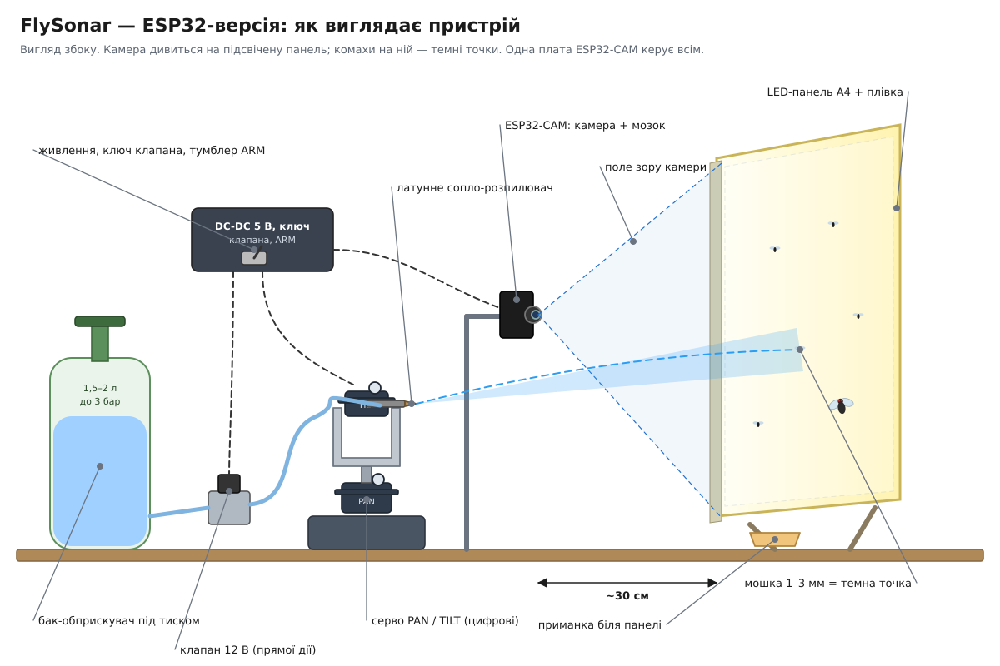
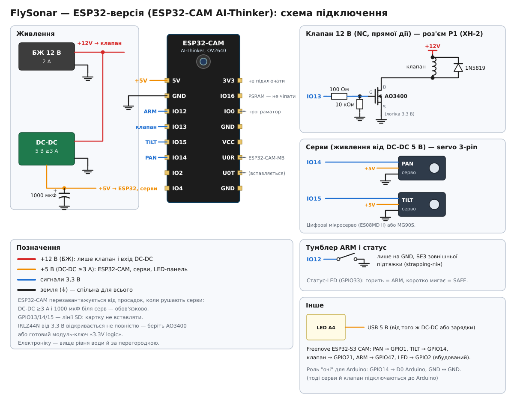

# FlySonar — ESP32-версія (камера, бачить мошку)

Одна плата **ESP32-CAM** або **ESP32-S3-CAM** робить усе: бачить комаху на підсвіченому фоні, веде ціль, наводить серви й відкриває клапан. **Arduino не потрібен.** Вона бачить **мошку 1–3 мм** і може стріляти по цілі в польоті.

Arduino-версія (сонар HC-SR04) описана в [flysonar.md](flysonar.md).

| | Arduino-версія | ESP32-версія |
|---|---|---|
| Плата | Arduino Uno / Nano | ESP32-CAM або ESP32-S3-CAM |
| Сенсор | HC-SR04 на турелі | камера над підсвіченим фоном |
| Кого бачить | мухи 6–8 мм, що сидять, 10–40 см | мухи й мошка 1–3 мм, у т.ч. в польоті |
| Точність | ~0,5° після уточнення | ~1 мм у площині фону (після калібрування) |
| Реакція | ~3 с скан + 1–2 с уточнення | ~70–90 мс |
| Прошивка | `firmware/flysonar` | `firmware/flysonar_esp32` |

> **Для 3D-друку:** турель, кріплення камери й підставка LED-панелі з жолобом — [cad/flysonar](../cad/flysonar/README.md) (головка `head_nozzle`, `camera_post` / `camera_cradle`, `stand_*`).

## Чому саме так

- **Підсвічений фон.** Комаха на світлій панелі дає чорну тінь з величезним контрастом, без складного розпізнавання. Так працюють і промислові оптичні «паркани» для комарів. Світла панель ще й сама приваблює комах, і вони **сідають на неї**. Це найлегші цілі, і для них немає паралакса (див. нижче).
- **Роздільність.** QVGA 320×240 на полі шириною ~30 см дає ~1 мм на піксель, тобто мошка займає 2–4 пікселі. Алгоритм ловить плями від 2 пікселів.
- **Камера нерухома, окремо від турелі.** Калібрування «піксель → кути серв» робиться тестовими пострілами, тож зміщення сопла й провисання струменя входять у модель автоматично.
- **Два ядра.** Зір працює в `loop()`. Серви, клапан, тумблер ARM і світлодіод обслуговує окрема задача кожну 1 мс, тому тривалість пострілу точна (±1 мс) і не залежить від кадрів камери.

## Що купити

| Деталь | К-сть | Примітка |
|---|---|---|
| ESP32-CAM AI-Thinker (OV2640, 4 МБ PSRAM) | 1 | Найдешевша. Або Freenove ESP32-S3-WROOM CAM (USB вбудований, більше вільних пінів) |
| Програматор ESP32-CAM-MB (USB) | 1 | Лише для AI-Thinker |
| LED-планшет для копіювання A4 (USB 5 В) | 1 | Фон. A3 теж можна, але тоді ~1,3 мм/піксель |
| Прозора плівка або оргскло 2 мм на панель | 1 | Захист від бризок, протирається |
| Кронштейн для камери | 1 | Жорсткий: камера не повинна зсуватися після калібрування |
| 2× цифрові мікросерво (напр. EMAX ES08MD II) або MG90S | 2 | Цифрові точніші (мертва зона ≤2–3 мкс проти ~1° у MG90S) |
| Pan-tilt кронштейн під мікросерво | 1 | |
| Садовий обприскувач 1,5–2 л + клапан 12 В NC **прямої дії** + фітинги | 1 | Або помпа R385 (`SHOOTER_VALVE 0`) |
| Латунне сопло-розпилювач 0,3–0,5 мм | 1–2 | Конус 2–4 см прощає залишкову похибку |
| MOSFET для 3,3 В логіки: AO3400 / IRLML6344 (SOT-23) або модуль-ключ «3.3V logic» | 1 | IRLZ44N від 3,3 В відкривається не повністю |
| Діод 1N5819, резистори 100 Ом і 10 кОм | 1 | Діод паралельно клапану, 100 Ом у затвор, 10 кОм затвор→GND |
| БЖ 12 В 2 А | 1 | Клапан |
| DC-DC 5 В **≥3 А** + електроліт 1000 мкФ | 1 | ESP32 і серви. ESP32-CAM дуже чутлива до просадок живлення |
| Тумблер ARM, чорна наліпка ∅3–5 мм (маркер для калібрування) | 1 | |

## Підключення (самостійна роль)

| Сигнал | ESP32-CAM AI-Thinker | Freenove ESP32-S3 CAM |
|---|---|---|
| Серво PAN | GPIO14 | GPIO1 |
| Серво TILT | GPIO15 | GPIO14 |
| Затвор MOSFET клапана | GPIO13 | GPIO21 |
| Тумблер ARM → GND | GPIO12 | GPIO47 |
| Статус-LED | GPIO33 (вбудований) | GPIO2 (вбудований) |

- **GPIO12 на AI-Thinker — strapping-пін:** якщо на старті він HIGH, плата не завантажиться. Тумблер ARM підключайте **лише на GND і без зовнішньої підтяжки**, підтяжку прошивка вмикає сама вже після старту.
- На AI-Thinker GPIO13/14/15 — лінії SD-картки, картку не вставляйте.
- Для інших S3-плат перевірте, що піни вільні: вони задаються константами `PIN_*` на початку скетча.
- **Живлення.** Серви живляться від DC-DC 5 В, ESP32 — від того ж DC-DC (пін 5V), з електролітом 1000 мкФ біля серв. Земля спільна з БЖ 12 В. Від'єднаний сигнал серви не повинен «висіти»: спершу підключайте землю.
- ⚠️ **Вода та електроніка.** Плату й живлення розміщуйте вище рівня бака і за перегородкою.

LED: блимає — ARM, горить — SAFE (тумблер вимкнено, стрільби немає).

## Прошивка

| Плата | PlatformIO | Arduino IDE |
|---|---|---|
| ESP32-CAM AI-Thinker | `pio run -e flysonar_esp32 -t upload` | «AI Thinker ESP32-CAM» |
| Freenove ESP32-S3 CAM / ESP32-S3-EYE | `pio run -e flysonar_esp32_s3 -t upload` | «ESP32S3 Dev Module», PSRAM: OPI, USB CDC On Boot: Enabled |

В Arduino IDE модель камери обирається `#define` на початку `flysonar_esp32.ino`. Там же `SHOOTER_VALVE`: 1 — клапан (50 мс), 0 — помпа (120 мс).

> ⚠️ Прошивку ESP32 перевірено лише статично. Сигнатури API звірено з `esp32-camera`, `arduino-esp32` та ESP-IDF, синтаксис перевірено компілятором на заглушках для обох плат і обох ролей. Логіку зору й турелі протестовано на ПК (`tools/run_tests.sh`). Повну збірку під ESP32 у середовищі розробки виконати не вдалося, тому перша збірка у вас може потребувати дрібних правок під версію ядра.

### Роль «очі» для Arduino (опційно)

Якщо Arduino-турель уже зібрана, ESP32 може працювати лише як камера й передавати кути на Arduino по UART. Стріляє тоді Arduino.
- ESP32: `pio run -e flysonar_esp32_eyes -t upload` (або `_s3_eyes`), чи `#define ESP32_ROLE_EYES 1`.
- Arduino: `pio run -e flysonar_camera -t upload` (або `TARGET_SOURCE_CAMERA 1` у `flysonar.ino`).
- Підключення: GPIO14 ESP32 → D0 (RX) Arduino, GND → GND. На час прошивки Arduino від'єднуйте D0 і нічого не надсилайте з монітора порту Arduino.

## Калібрування

Монітор порту **ESP32** на 115200. Команди — одна клавіша:

| Клавіша | Дія |
|---|---|
| `m` | увімкнути/вимкнути режим калібрування |
| `a d w s` | довернути турель на 0,5° (великі `A D W S` — на 5°) |
| `f` | тестовий постріл 40 мс (тумблер ARM має бути увімкнений) |
| `c` | записати точку: пляма маркера ↔ поточні кути |
| `u` | скасувати останню точку |
| `v` | розрахувати й зберегти (≥3 точки) |
| `b` | перевчити фон |
| `t` | стріляти також по цілях у польоті (з упередженням) |
| `p` | стан: fps, калібрування, ціль, швидкість |

Порядок:
1. Увімкнути панель, прибрати все з поля. Через 2,5 с після старту експозиція фіксується і фон вивчається сам (або натисніть `b`).
2. `m`. Кнопками `a d w s` навести турель приблизно в кут поля.
3. `f`: на плівці з'явиться мокра пляма. Покладіть маркер точно на неї, тоді `c` (у кадрі має бути рівно одна темна точка).
4. Повторити для 4–6 точок по всьому полю: кути й центр. Точки не мають лежати на одній прямій.
5. `v`. Плата покаже найгіршу залишкову похибку в градусах. Приберіть маркер, протріть плівку, натисніть `b`, потім `m` (вихід у бойовий режим).

Калібрування зберігається у флеш-пам'яті й переживає перезавантаження.

## Як працює

1. **Фон** — ковзне середнє кадрів. Під темними плямами фон не оновлюється, тому муха, що сіла, не «розчиняється» у фоні.
2. **Маска.** Піксель вважається темною плямою, якщо він на панелі (фон ≥ `backdropMin`) і темніший за фон на `darkDelta`.
3. **Плями.** Зв'язні області від 2 пікселів і не більші за 14×14 — цілі. Більші, або понад 400 темних пікселів у кадрі (рука, кіт, людина), блокують стрільбу на 3 с і миттєво закривають клапан.
4. **Трекер альфа-бета** згладжує позицію й оцінює швидкість у пікселях/с.
5. **Приціл.** Ціль повільніша за 15 пікс/с вважається нерухомою, і приціл береться в поточну точку. По цілі в польоті приціл береться в точку, де вона буде через `LATENCY_MS` (70 мс), але лише з увімкненим `t`.
6. **Дозвіл стріляти** дає зір: ціль підтверджена ≥5 кадрів поспіль, у поточному кадрі видна, великого об'єкта не було 3 с.
7. **Турель** (`turret.h`, та сама логіка, що й в Arduino-версії) стріляє лише коли ARM увімкнено, серво доїхало, дозвіл свіжий (≤150 мс), серія не вичерпана (3 постріли) і минув кулдаун. Вимкнення ARM закриває клапан посеред пострілу.
8. **Серви** керуються через драйвер LEDC на окремому таймері (не на таймері тактування камери) з кроком ~0,12°.

## Обмеження (чесно)

- **Паралакс.** Камера бачить 2D. Калібрування зроблене в площині панелі, тож ціль на відстані Δ перед панеллю дає похибку ≈ (відстань камера↔сопло) × Δ / (відстань до панелі). Ставте камеру якомога ближче до осі турелі (3–5 см). Найточніше влучання — по комахах, що сіли на панель, тож біля неї варто покласти приманку (сироп, оцет).
- **Політ.** OV2640 дає ~25–30 кадрів/с, повна затримка ~70–90 мс. Мошка за цей час зміщується на 3–8 см, і упередження компенсує це лише для рівного польоту. Для цілей у польоті використовуйте розпилювач, а не голку.
- **Змазування.** OV2640 має «біжучий» затвор, тож швидка комаха виходить злегка розмазаною. На центроїд це майже не впливає.
- **Освітлення.** Фон має бути **стабільно** яскравим. Пряме сонце на панель чи миготливі лампи дають хибні плями. Експозиція фіксується після старту: якщо світло в кімнаті змінилося, перезавантажте плату або натисніть `b`.
- **Живлення ESP32-CAM.** Найчастіша проблема — перезавантаження, коли рушають серви. Окремий DC-DC ≥3 А і електроліт біля серв обов'язкові.
