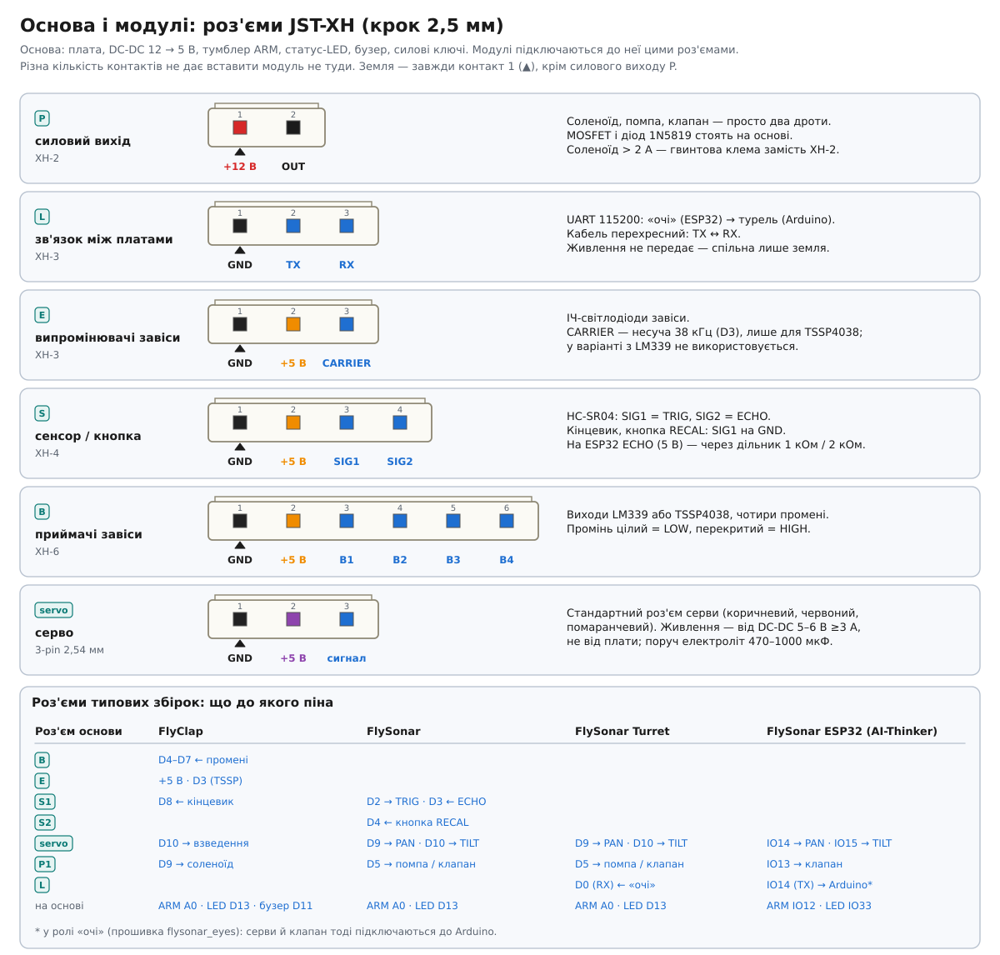
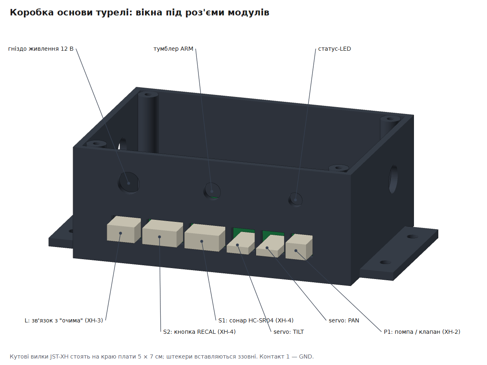

# Модульна система: основа + модулі

Будь-який пристрій fly-defense складається з **основи** і **модулів**. Спершу збирається основа. Потім до неї підключаються модулі: в залізі — роз'ємами JST-XH, у прошивці — двома рядками коду. Три готові пристрої (FlyClap, FlySonar, FlySonar ESP32) — лише типові комбінації цих модулів. Можна зібрати свою.

```
                ┌──────────────── ОСНОВА ────────────────┐
                │ плата (Uno / Nano / ESP32-CAM)         │
                │ живлення 12 В → DC-DC 5 В              │
                │ тумблер ARM · статус-LED · бузер       │
                │ силові виходи (MOSFET + діод)          │
                └──┬─────────┬─────────┬─────────┬───────┘
          сенсори  │         │ серви   │ сила    │ зв'язок
        (XH-4/XH-6)│  (3-pin servo)    │ (XH-2)  │ (XH-3)
                   ▼         ▼         ▼         ▼
            завіса, сонар  pan-tilt  соленоїд,  інша плата
            кінцевик, RECAL           помпа,    ("очі")
                                      клапан
```

## Прошивка: бібліотека FlyDefense

Проєкт — звичайний проєкт PlatformIO з фреймворком Arduino. Модулі лежать у бібліотеці `lib/FlyDefense`, а кожен пристрій — це маленька прошивка в `src/<назва>/main.cpp`, що збирає його з модулів:

```cpp
#include <Arduino.h>
#include <FlyDefense.h>

fly::Base base(A0, 13);                    // основа: тумблер ARM, статус-LED
fly::IrCurtain curtain(4, 5, 6, 7);        // модуль-тригер
fly::ClapLatch clap(curtain, 9, 10, 8);    // модуль-виконавець

void setup() {
  base.add(curtain);
  base.add(clap);
  base.begin();
}

void loop() { base.update(); }
```

### Збірка

Відкрийте репозиторій у PlatformIO й виберіть середовище: `pio run -e flyclap -t upload` (див. [README](../README.md#збірка)). Кожне середовище в `platformio.ini` збирає одну прошивку з `src/`. Для своєї збірки є шаблон `src/mybuild` і середовище `mybuild`.

### Основа (`fly::Base`)

Основа є в кожній збірці й відповідає за безпеку:

- **Тумблер ARM** (до GND) — єдиний дозвіл на постріл для всіх модулів. Вимкнення миттєво зупиняє все: закриває клапан, знеструмлює соленоїд, відводить серво.
- **Реєстр пінів і таймерів.** Якщо два модулі хочуть один пін або таймер, у Serial з'явиться, наприклад, `CONFIG ERROR: pin 9 wanted by Turret, already used by ClapLatch`, і пристрій не озброїться, доки конфігурацію не виправлять.
- **Статус-LED** — однаковий для всіх пристроїв:

| LED | Значення |
|---|---|
| коротке мигання раз на 2 с | SAFE: ARM вимкнено, пристрій живий |
| горить | ARM, усе готово |
| повільно блимає | ARM, модуль зайнятий (взводиться, калібрується, чекає чистої завіси) |
| швидко блимає | аварія, помилка конфігурації або немає зв'язку з «очима» |

- **Бузер** (необов'язковий): `base.buzzer(pin)` — пасивний (тон), `base.buzzer(pin, true)` — активний.
- **Лог** у Serial на 115200.

## Каталог модулів

| Модуль | Роль | Що підключається | Плати | Роз'єми |
|---|---|---|---|---|
| `IrCurtain` | тригер | ІЧ-завіса з 4 променів: LM339 або TSSP4038 | AVR | XH-6 приймачі, XH-3 випромінювачі |
| `ClapLatch` | виконавець | засувка-хлопавка: соленоїд, серво взведення, кінцевик | AVR | XH-2 соленоїд, servo, XH-4 кінцевик |
| `Turret` = `PanTilt` + `Nozzle` | виконавець | pan-tilt на двох сервах + помпа або клапан | AVR, ESP32 | 2× servo, XH-2 ствол |
| `Sonar` | сенсор для `Turret` | HC-SR04 на голові турелі, кнопка RECAL | AVR, ESP32 | XH-4 сонар, XH-4 кнопка |
| `CameraEyes` | сенсор для `Turret` або `LinkOut` | камера ESP32 над підсвіченим фоном | ESP32 з PSRAM | — (камера на платі) |
| `LinkOut` | зв'язок | передає рішення сенсора на іншу плату | ESP32 (будь-який UART) | XH-3 зв'язок |
| `EyesLink` | зв'язок | приймає команди від `LinkOut` і наводить `Turret` | AVR, ESP32 | XH-3 зв'язок |

Сенсори турелі не знають, хто стріляє: `CameraEyes` однаково віддає рішення турелі на цій же платі (`Turret`) або Arduino по дроту (`LinkOut` → `EyesLink` → `Turret`). Постріл завжди проходить через `Turret`, тому правила безпеки однакові для всіх джерел цілей: ARM, доворот серв, свіжий дозвіл, серія з 3 пострілів, кулдаун, пауза після великого об'єкта.

### Типові збірки

| Прошивка | Плата | Модулі | Середовище PlatformIO |
|---|---|---|---|
| `src/flyclap` | Uno / Nano | `IrCurtain` + `ClapLatch` | `flyclap`, `flyclap_tssp`, `flyclap_nano` |
| `src/flysonar` | Uno / Nano | `Turret` + `Sonar` | `flysonar`, `flysonar_nano` |
| `src/flysonar_turret` | Uno / Nano | `Turret` + `EyesLink` | `flysonar_turret`, `flysonar_turret_nano` |
| `src/flysonar_eyes` | ESP32-CAM / S3 | `CameraEyes` + `LinkOut` | `flysonar_esp32_eyes`, `flysonar_esp32_s3_eyes` |
| `src/flysonar_esp32` | ESP32-CAM / S3 | `Turret` + `CameraEyes` | `flysonar_esp32`, `flysonar_esp32_s3` |
| `src/mybuild` | будь-яка | шаблон своєї збірки | `mybuild` |

## Залізо: роз'єми JST-XH

Усі модулі підключаються до основи роз'ємами **JST-XH (крок 2,5 мм)**: вони не вставляються навпаки, тримаються від вібрації хлопавки і дешеві. Різна кількість контактів у різних типів роз'ємів не дає переплутати, наприклад, силовий вихід 12 В із сенсором. Серви лишаються на своєму стандартному 3-pin роз'ємі: він є на кожній серві.



Контакт 1 позначений на платі трикутником. Земля — завжди контакт 1 (крім силового виходу P). На схемах підключення кожен сигнал має зелену мітку роз'єму й контакту: `B·3` — роз'єм B, контакт 3.

| Тип | Роз'єм | 1 | 2 | 3 | 4 | 5 | 6 |
|---|---|---|---|---|---|---|---|
| **P** — силовий вихід | XH-2 | +12 В | OUT (стік MOSFET) | | | | |
| **L** — зв'язок між платами | XH-3 | GND | TX | RX | | | |
| **E** — випромінювачі завіси | XH-3 | GND | +5 В | CARRIER (несуча TSSP) | | | |
| **S** — сенсор / кнопка | XH-4 | GND | +5 В | SIG1 | SIG2 | | |
| **B** — приймачі завіси | XH-6 | GND | +5 В | B1 | B2 | B3 | B4 |
| **servo** | 3-pin 2,54 | GND (коричневий) | +5 В з DC-DC (червоний) | сигнал (помаранчевий) | | | |

- **P (силовий вихід).** MOSFET (IRLZ44N для 5 В логіки, AO3400 для ESP32) і захисний діод 1N5819 паралельно навантаженню стоять **на основі**. Тож соленоїд, помпа чи клапан — це просто навантаження на двох дротах. Для соленоїда понад 2 А використовуйте гвинтову клему замість XH-2. Біля соленоїда — електроліт 1000–2200 мкФ.
- **L (зв'язок).** TX однієї плати з'єднується з RX іншої, тож кабель перехресний (2↔3). Живлення по L не передається: кожна плата живиться від свого DC-DC, спільна лише земля. Логіка ESP32 — 3,3 В; Arduino приймає її на RX напряму.
- **S (сенсор).** HC-SR04: SIG1 = TRIG, SIG2 = ECHO. Кінцевик і кнопка: SIG1 на GND, SIG2 не використовується. На ESP32 ECHO сонара (5 В) заводьте через дільник 1 кОм / 2 кОм.
- **servo.** Живлення серв — від DC-DC 5–6 В ≥3 А, не від плати, з електролітом 470–1000 мкФ поруч із роз'ємами.

### Роз'єми типових збірок

| Роз'єм основи | FlyClap | FlySonar | FlySonarTurret | FlySonar ESP32 (AI-Thinker) |
|---|---|---|---|---|
| B (XH-6) | D4–D7 | | | |
| E (XH-3) | +5 В / D3 (TSSP) | | | |
| S1 (XH-4) | кінцевик → D8 | сонар → D2 / D3 | | |
| S2 (XH-4) | | RECAL → D4 | | |
| servo 1 | взведення → D10 | PAN → D9 | PAN → D9 | PAN → GPIO14 |
| servo 2 | | TILT → D10 | TILT → D10 | TILT → GPIO15 |
| P1 (XH-2) | соленоїд ← D9 | помпа / клапан ← D5 | помпа / клапан ← D5 | клапан ← GPIO13 |
| L (XH-3) | | | RX ← D0 | (роль «очі»: TX GPIO14) |
| на основі | ARM A0, LED D13, бузер D11 | ARM A0, LED D13 | ARM A0, LED D13 | ARM GPIO12, LED GPIO33 |

### Корпус основи (3D-друк)

Основа живе в коробці під плату 5 × 7 см. У її стінці — вікна під кутові вилки JST-XH (S?B-XH-A), припаяні на краю плати, тож штекери модулів вставляються ззовні. Над вікнами — отвори під гніздо живлення, тумблер ARM і статус-LED.

| FlyClap: блок електроніки | FlySonar: коробка основи |
|---|---|
|  |  |

Обидві коробки генерує одна функція `base_box()` у [`cad/cadlib.py`](../cad/cadlib.py): вікна розкладаються зі списку роз'ємів збірки (`BASE_PORTS`), тож для своєї збірки достатньо змінити цей список. Файли для друку — у [cad/flyclap](../cad/flyclap/README.md) і [cad/flysonar](../cad/flysonar/README.md).

## Сумісність і обмеження

- **AVR (Uno / Nano):** `IrCurtain` використовує переривання PCINT, тому не поєднується з бібліотекою `SoftwareSerial`. Варіант TSSP займає Timer2 (несуча на D3), отже бузер має бути активним. D0/D1 зайняті USB-логом; `EyesLink` слухає D0.
- **ESP32:** `IrCurtain` і `ClapLatch` поки лише для AVR. Бузер лише активний, бо `tone()` конфліктує з тактуванням камери. Серви працюють на LEDC timer 2, максимум 4. Задача реального часу (tick модулів, 1 мс) виконується на ядрі 0.
- Одна основа — один `IrCurtain`.

## Свій модуль

Модуль — клас-нащадок `fly::Module`. Основа викликає його методи сама:

| Метод | Коли | Що робити |
|---|---|---|
| `begin(base)` | один раз на старті | зайняти піни (`base.claimPin`), налаштувати залізо; `false` — конфігурація неможлива |
| `tick(base, now)` | ~кожну 1 мс | швидка робота без блокувань: таймінги, опитування |
| `loop(base)` | з `loop()` | довга робота; чекати можна лише через `base.wait(ms)` |
| `disarm(base)` | ARM вимкнено | негайно зупинити все, що рухається чи стріляє |
| `health()` | постійно | `Ok`, `Busy` чи `Fault` — для статус-LED |

Каркас є в `src/mybuild/main.cpp`. Корисні точки розширення:

- **новий тригер для хлопавки** (п'єзо, ємнісний датчик, інша завіса) — нащадок `fly::Trigger`, який викликає `crossedFromIsr()`; `ClapLatch` працюватиме з ним без змін;
- **нове джерело цілей для турелі** — будь-який модуль, що викликає `aim()` / `bigObject()` в `fly::AimTarget`;
- **інший ствол** — свій `fly::Nozzle::Profile {тривалість_мс, провисання_×100}`.

Перш ніж пропонувати модуль у репозиторій, додайте тест у `test/test_<назва>/` за зразком наявних і запустіть `pio test -e native`.
