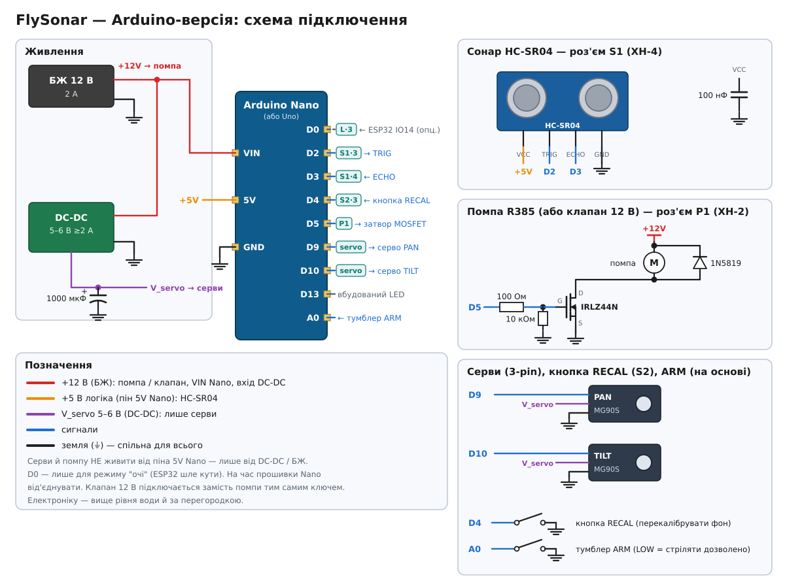

# 📐 Схеми та ілюстрації

Схеми підключення й картинки «як виглядає пристрій» для всіх пристроїв. Кожна картинка є у двох форматах:

- **SVG** (у цій папці): масштабується без втрат, показується в документації на GitHub;
- **PNG** (у [`png/`](png/)): 2400 px завширшки, щоб відкрити на телефоні або роздрукувати.

| Пристрій | Як виглядає | Схема підключення |
|---|---|---|
| **FlyClap** | [SVG](flyclap-device.svg) · [PNG](png/flyclap-device.png) | варіант A (LM339): [SVG](flyclap-wiring.svg) · [PNG](png/flyclap-wiring.png)<br>варіант B (TSSP4038): [SVG](flyclap-tssp.svg) · [PNG](png/flyclap-tssp.png) |
| **FlySonar — Arduino** | [SVG](flysonar-arduino-device.svg) · [PNG](png/flysonar-arduino-device.png) | [SVG](flysonar-arduino-wiring.svg) · [PNG](png/flysonar-arduino-wiring.png) |
| **FlySonar — ESP32** | [SVG](flysonar-esp32-device.svg) · [PNG](png/flysonar-esp32-device.png) | [SVG](flysonar-esp32-wiring.svg) · [PNG](png/flysonar-esp32-wiring.png) |

Кольори дротів на всіх схемах однакові: 🔴 +12 В · 🟠 +5 В · 🟣 живлення серв · 🔵 сигнали · ⚫ земля.

Ілюстрації умовні (пропорції не в масштабі), це не креслення для кріплень. Подробиці — у документації: [FlyClap](../docs/flyclap.md), [FlySonar — Arduino](../docs/flysonar.md), [FlySonar — ESP32](../docs/flysonar-esp32.md).

## Як оновити

Картинки генерує [`tools/diagrams.py`](../tools/diagrams.py) (лише стандартна бібліотека Python). Змінили пін чи номінал — правите скрипт і з кореня репозиторію запускаєте:

```bash
python3 tools/diagrams.py          # лише SVG
python3 tools/diagrams.py --png    # SVG + PNG (потрібен Chromium; шлях можна задати змінною CHROME)
```

---





